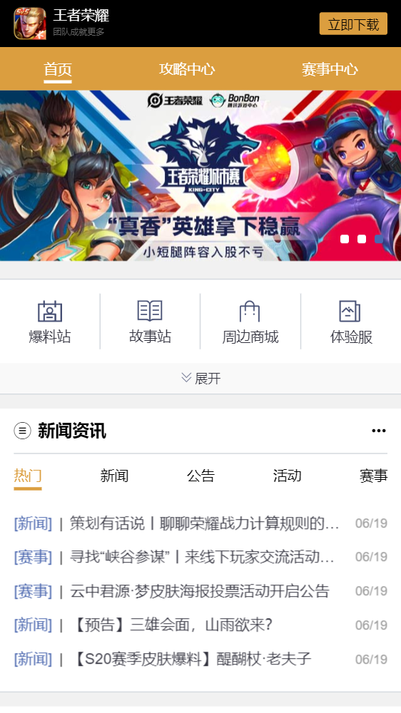
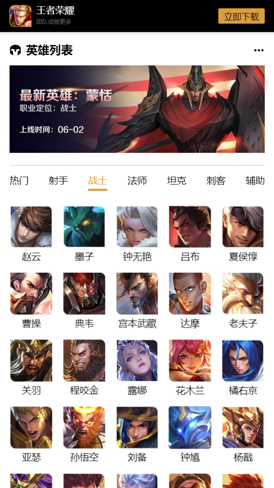
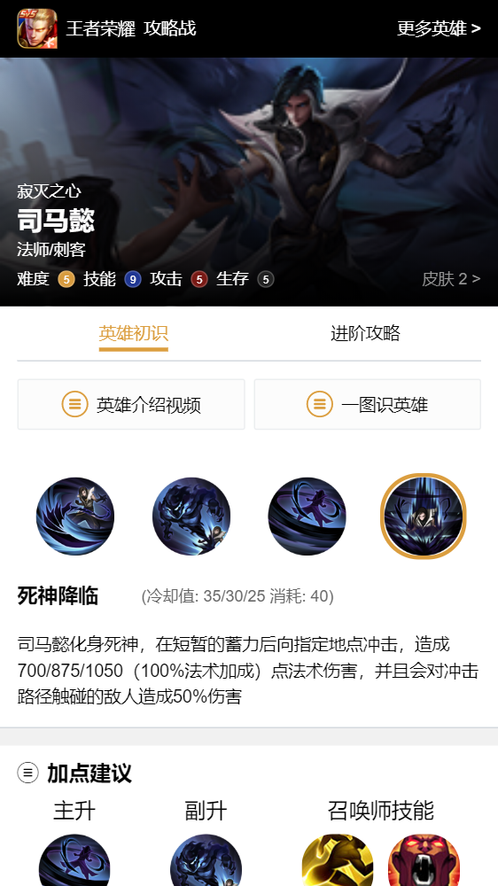
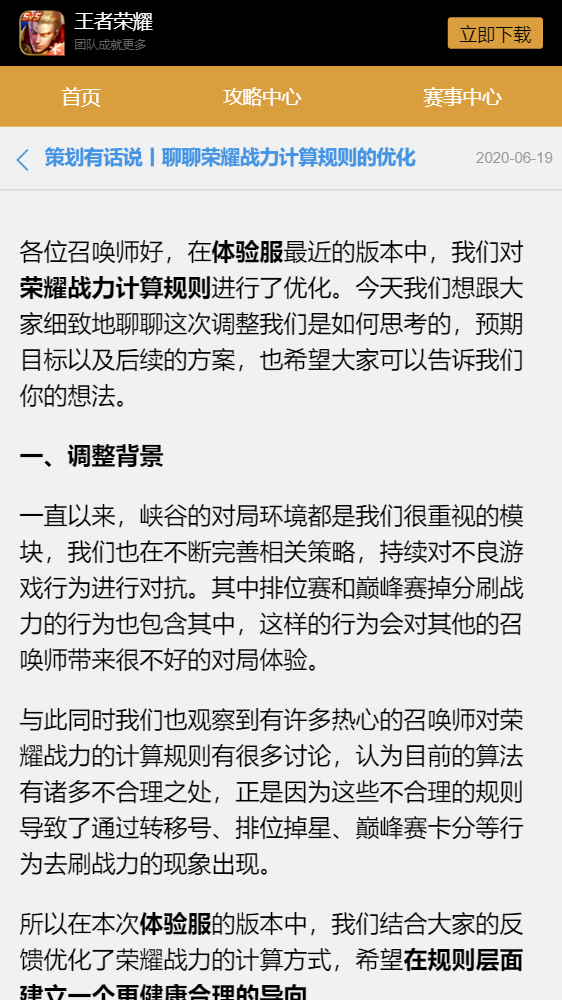
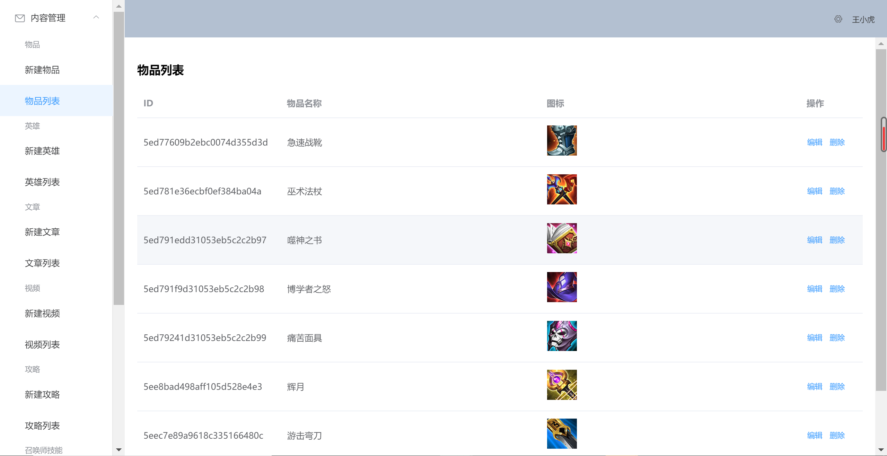
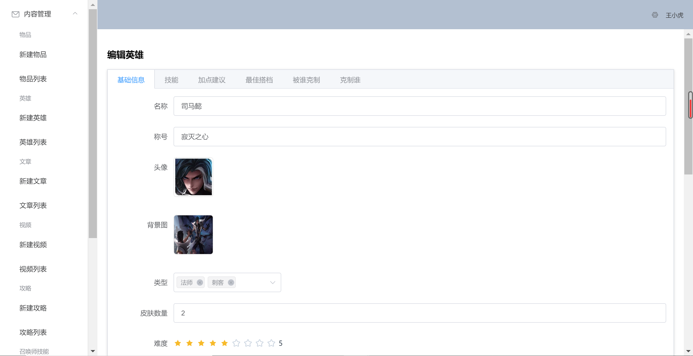

# vue-node-demo
Vue.js+Node.js+Element-ui实现仿王者荣耀手机端官网

# 1.环境安装
npm、node.js、express、mongodb、vue-cli等。
## 目录结构
```
├─admin                 // 后台目录
│  ├─node_modules
│  ├─public             // 静态文件
│  └─src
│      ├─assets         // 样式文件
│      ├─components     // 全局组件
│      ├─plugins        // 插件
│      ├─router         // 后台页面路由
│      └─views          // 后台pages
├─picture               // 预览图片
├─server                // 服务端目录
│  ├─middleware         // 中间件
│  ├─models             // 数据模型
│  ├─node_modules
│  ├─plugins            // 服务端插件
│  ├─routes
│  │  ├─admin           // 后台api
│  │  └─web             // web端api
│  └─uploads            // 静态文件上传目录
└─web                   // web端目录
    ├─node_modules
    ├─public            // 静态文件
    └─src
        ├─assets        
        │  ├─iconfont   // 字体图标
        │  ├─images     // 图片
        │  └─scss       // scss样式
        ├─components    // 全局组件
        ├─router        // 路由
        └─views         // 前端pages
```

## 相关依赖
```js
// web
"dependencies": {
    "axios": "^0.19.2",
    "core-js": "^3.6.5",
    "swiper": "^5.4.5",
    "vue": "^2.6.11",
    "vue-awesome-swiper": "^4.1.1",
    "vue-router": "^3.2.0"
  },
  "devDependencies": {
    "@vue/cli-plugin-babel": "~4.4.0",
    "@vue/cli-plugin-eslint": "~4.4.0",
    "@vue/cli-plugin-router": "^4.4.4",
    "@vue/cli-service": "~4.4.0",
    "babel-eslint": "^10.1.0",
    "eslint": "^6.7.2",
    "eslint-plugin-vue": "^6.2.2",
    "sass": "^1.26.8",
    "sass-loader": "^8.0.2",
    "vue-template-compiler": "^2.6.11"
  },
```

```js
// admin
"dependencies": {
    "axios": "^0.19.2",
    "core-js": "^3.6.5",
    "element-ui": "^2.4.5",
    "vue": "^2.6.11",
    "vue-router": "^3.2.0",
    "vue2-editor": "^2.10.2"
  },
  "devDependencies": {
    "@vue/cli-plugin-babel": "~4.4.0",
    "@vue/cli-plugin-eslint": "~4.4.0",
    "@vue/cli-plugin-router": "^4.4.1",
    "@vue/cli-service": "~4.4.0",
    "babel-eslint": "^10.1.0",
    "eslint": "^6.7.2",
    "eslint-plugin-vue": "^6.2.2",
    "vue-cli-plugin-element": "~1.0.1",
    "vue-template-compiler": "^2.6.11"
  },

```
```js
// server
"dependencies": {
    "bcrypt": "^5.0.0",
    "cors": "^2.8.5",
    "express": "^5.0.0-alpha.8",
    "http-assert": "^1.4.1",
    "inflection": "^1.12.0",
    "jsonwebtoken": "^8.5.1",
    "mongoose": "^5.9.16",
    "multer": "^1.4.2",
    "require-all": "^3.0.0"
  }
```

# 2.管理后台
1. Element UI的后台管理基础界面搭建
2. 分类管理
3. 通用CRUD接口封装
4. 装备、铭文、召唤师技能管理
5. 图片upload (multer)
6. 英雄管理 (基础信息、技能、加点建议、英雄关系)
7. 文章管理
8. 富文本编辑器 (quill)
9. 首页幻灯片广告管理
10. 管理员账号管理 (bcrypt)
11. 登录页面
12. 登录验证 ((jwt,jsonwebtoken))
13. 上传文件的登录校验 (el-upload, headers)

# 3.移动端
1. 常用css样式定义 (SCSS、颜色、字体、flex、边距、边框)
```scss
// colors
$color: (
  "primary": #db9e3f,
  "info": #4b67af,
  "danger": #791a15,
  "blue": #4394e4,
  "blue-1": #1f3695,
  "white": #fff,
  'white-1': #fcfcfc,
  'white-2': #eceef0,
  "light": #f9f9f9,
  "light-1": #d4d9de,
  "grey": #999,
  "grey-1": #666,
  "dark-1": #343440,
  "dark": #222,
  "black": #000,
);

@each $colorKey, $color in $color {
  .text-#{$colorKey} {
    color: $color;
  }
  .bg-#{$colorKey} {
    background-color: $color;
  }
}
```
2. 首页轮播图 (vue swiper)
3. 精灵图片 (sprite)
4. 卡片组件 (card)
5. 列表卡片组件 (list-card, nav, swiper)
6. 新闻资讯
7. 英雄列表
8. 英雄详情
9. 精彩视频
10. 图文攻略
11. 数据录入方式

进入王者荣耀手官网，打开控制台，输入以下代码即可提取英雄数据
```javascript
// 英雄
JSON.stringify($$('.hero-nav > li').map((v,i) => {
    return {
        name: v.innerText,
        hreos: $$('li', $$('.hero-list')[i]).map(el =>{
       return {
        name: $$('h3', el)[0].innerHTML,
        avatar: $$('img', el)[0].src}})
    }}))
```
后台写接口初始化数据
```js
// 导入英雄
  router.get('/heroes/init', async (req, res) => {
    await Hero.deleteMany({})
    const raw_data_1 = [{ "name": "热门", "heroes": [{ "name": "后羿", "avatar": "https://game.gtimg.cn/images/yxzj/img201606/heroimg/169/169.jpg"}, .....}]}]
    // 根据name去重
    function unique(data){
      const nameSet = new Set()
      let res = []
      for(let item of data) {
        if(item.name === '热门'){
          res.push(item)
          continue
        }
        let tempheros = {
          name: item.name,
          heroes: []
        }
        for(let hero of item.heroes) {
          if (!nameSet.has(hero.name)) {
            nameSet.add(hero.name)
            tempheros.heroes.push(hero)
          }
        }
        res.push(tempheros)
      }
      return res
    }
    const raw_data = unique(raw_data_1)
    for (let cat of raw_data) {
      if (cat.name === "热门") {
        continue
      }
      // 找到当前分类在数据库中对应的数据
      const category = await Category.findOne({
        name: cat.name
      })
      cat.heroes.map(hero => {
        hero.categories = [category]
        return hero
      })
      // 录入英雄
      await Hero.insertMany(cat.heroes)
    }
    res.send(await Hero.find())
  })
```

# 3.效果预览
## 移动端页面
### 首页及新闻资讯

### 英雄列表

### 英雄详情

### 新闻详情

### 精彩视频

### 图文攻略


## 后台部分页面
### 装备列表

### 英雄编辑


# 4.参考资料
- [Bilibili 全栈之巅](https://space.bilibili.com/341919508)
- [https://github.com/wxs77577/node-vue-moba](https://github.com/wxs77577/node-vue-moba)
- [菜鸟教程-MongoDB 教程](https://www.runoob.com/mongodb/mongodb-tutorial.html)